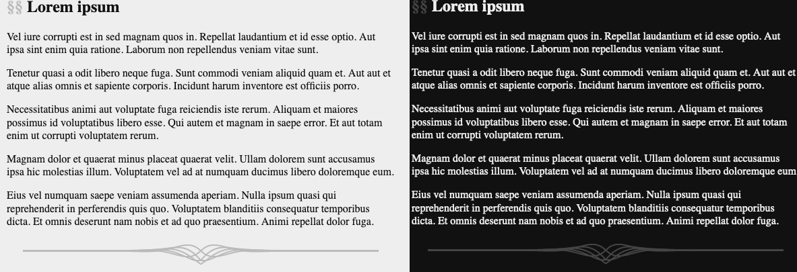

Fancy horizontal rule
=====================

I spent some time recently designing a fancy HR for a forthcoming personal
website. I probably should have spent more time on the actual website...
hence it is still forthcoming. But anyway, I think this is pretty and I
decided to share it.

Here is the SVG:


And here is a demo of a pure-CSS deployment to the draft website (in both
light and dark modes):




Designing the rule SVG
----------------------

The steps were as follows:

0. Tweak the equations for the curves on a graphing calculator.
1. Export to SVG.
2. Crop and get the colours and widths right.
3. Minimise with SVG OMG.

The equations are as follows:

```
  exp(-2/3 |x|) sin(x)
- exp(-2/3 |x|) sin(x)
  exp(-2/3 |x|) sin(x - pi/4)
- exp(-2/3 |x|) sin(x + pi/4)
- exp(-2/3 |x|) cos(x)
```

There are a lot of +/- there but there is some symmetry going:
The phases of these sinusoids are spaced around a circle (missing a couple of
spots)... or *something* like that, I can't remember since it was some time
ago that I made these equations.


Embedding the rule with CSS
---------------------------

The idea is to use some custom CSS to replace the default HR with
a cropped version of this graphic.

The SVG is added as a pseudoelement and so it's not trivial to set the colour.
For grayscale, the following hack works:

```
/* set the colours */
:root[color-scheme="light"] {
  /* light theme */
  /* hack: filter pseudocontent from black to #bbb */
  --hrule: invert(73%);
}
:root[color-scheme="dark"] {
  /* dark theme */
  /* hack: filter pseudocontent from black to #444 */
  --hrule: invert(27%);
}

/* fancy HR */
hr {
  margin: 1.5em;
  border: none;
  overflow: hidden;
  display: flex;
  justify-content: center;
  /* height of svg */
  max-height: 30px;
}
hr::after {
  filter: var(--hrule);
  /* svg */
  content: url("data:image/svg+xml,%3Csvg width='1200' height='30' xmlns='http://www.w3.org/2000/svg'%3E%3Cg fill='none' stroke-width='2' stroke='%23000'%3E%3Cpath d='M0 9.49h400l79.59-.08 17.19-.49 18.26-.47 8.1.05 6.65.3 5.95.53 5.67.77 5.66 1.03 6.15 1.4 8.8 2.3 7.8 1.97 4.4.83 3.51.41 3.03.1 2.74-.16 2.54-.4 2.44-.66 2.44-.94 2.34-1.2 2.44-1.59 2.54-2.03 6.94-5.97 2.53-1.5 2.45-1.12 2.44-.81 2.54-.55 2.63-.3 2.84-.04 3.12.22 3.61.54 4.4.93 6.64 1.7 11.03 2.85 6.06 1.26 5.66.9 5.67.66 6.05.42 6.74.2 8.2-.03 12.5-.35 23.34-.64 16.7-.15 26.66.05 33.01.08h400'/%3E%3Cpath d='M0 9.51h400l79.59.08 17.19.49 18.26.47 8.1-.05 6.65-.3 5.95-.53 5.67-.77 5.66-1.03 6.15-1.4 8.8-2.3 7.8-1.97 4.4-.83 3.51-.41 3.03-.1 2.74.16 2.54.4 2.44.66 2.44.94 2.34 1.2 2.44 1.59 2.54 2.03 6.94 5.97 2.53 1.5 2.45 1.12 2.44.81 2.54.55 2.63.3 2.84.04 3.12-.22 3.61-.54 4.4-.93 6.64-1.7 11.03-2.85 6.06-1.26 5.66-.9 5.67-.66 6.05-.42 6.74-.2 8.2.03 12.5.35 23.34.64 16.7.15L767 9.57 800 9.49h400'/%3E%3Cpath d='M0 9.5h400l62.2.04 23.05.38 17.39.21 9.47-.15 7.91-.38 7.32-.61 7.43-.9 9.27-1.39L555.57 5l5.07-.49 4.1-.13 3.62.14 3.22.38 3.03.6 2.93.87 2.83 1.1 2.83 1.4 2.93 1.79 3.03 2.2 3.13 2.66 3.22 3.14 3.42 3.73 1.27 1.3 2.05.32 2.14.07 2.35-.18 2.54-.47 2.93-.82 3.61-1.3 4.98-2.13 12.8-5.6 4.97-1.79 4.6-1.36 4.39-1.02 4.5-.77 4.68-.54 5.08-.3 5.76-.1 7.13.17 11.13.56 18.07.88 12.3.32 14.45.1 27.74-.16 36.91-.1H1200'/%3E%3Cpath d='M0 9.47h400l43.75.11 35.84.1 13.18-.26 12.4-.5 26.57-1.21 6.25.08 5.27.31 4.79.55 4.49.78 4.4 1.03 4.49 1.33 4.68 1.68 5.47 2.27 15.33 6.58 3.32.99 2.74.55 2.44.22 2.25-.06 2.05-.31.39-.18 3.61-4.05 3.32-3.33 3.13-2.74 3.12-2.36 3.13-1.95 3.02-1.54 2.93-1.16 2.93-.87 3.03-.62 3.22-.38 3.52-.15 3.9.11 4.6.4 6.05.81 21.87 3.16 7.33.66 7.52.4 8.5.2 10.74-.04 60.64-.65 33.79.06h400'/%3E%3Cpath d='M0 9.48h400l49.02.06 48.05.23 10.06-.33 9.47-.58 11.13-.96 14.07-1.2 5.95-.23 4.79.07 4.2.32 3.9.56 3.62.78 3.51 1.02 3.52 1.32 3.61 1.65 3.71 2.02 4.1 2.59 4.89 3.46 12.5 9.17 4.2-3 14.06-10.34 4.2-2.55 3.8-1.97 3.62-1.54 3.61-1.24 3.62-.94 3.7-.69 3.91-.45 4.3-.22 4.79.02 5.86.3 8.59.72 17.38 1.5 9.47.51 9.97.27 12.1.06 22.56-.23 28.62-.18 31.54.02h400'/%3E%3C/g%3E%3C/svg%3E");
}
```


Made with :purple_heart: by Matt.
