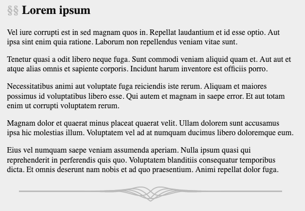

I spent some time recently designing a fancy HR for an upcoming
personal website. I probably should have spent more time on the
actual website... but anyway, I think it's pretty, here it is.


I built it as follows:

0. Tweak the equations for the curves on a graphing calculator.
1. Export to SVG.
2. Crop and get the colours and widths right.
3. Minimise with SVG OMG.

The idea is to use some custom CSS to replace the default HR with
(a cropped version of) this on my website.

The equations are as follows:

```
  exp(-2/3 |x|) sin(x)
- exp(-2/3 |x|) sin(x)
  exp(-2/3 |x|) sin(x - pi/4)
- exp(-2/3 |x|) sin(x + pi/4)
- exp(-2/3 |x|) cos(x)
```

There is some symmetry going on there, the phases of these sinusoids are
spaced around a circle (missing one or more spots)... or something like that,
I can't remember since it was some time ago.

Anyway here's how it looks on the draft website:



